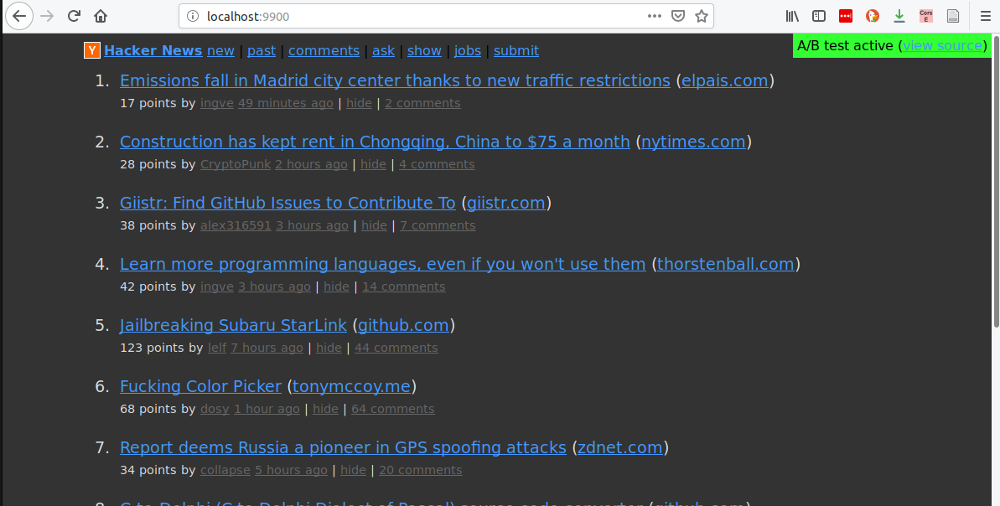
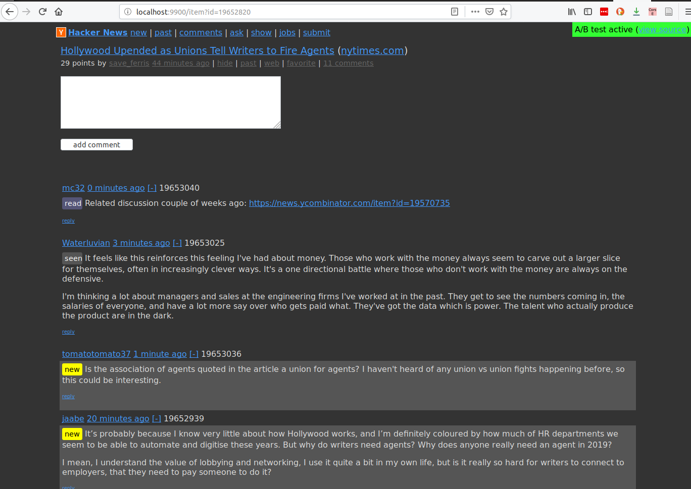

# Ablayer hackernews example

This is a demonstration of how [ablayer](https://github.com/j-angnoe/ablayer) can be used to locally 
augment the functionality of an external site.

It features:
- A dark theme

- Tracks new/seen/read comments


When you run this example you'll be able to browse hackernews
via http://localhost:9900. 

## How it works
We overwrite the external news.css with our local [./news.css]

The new/seen/read functionality can be  found inside [./abtest.js]
This file will be injected in the <head> of html files that are 
served via ablayer. This allows us to inject our own functionality.

## Installation
```sh
# Make sure you have ablayer installed globally for easy hacking!
npm install -g ablayer;

git clone https://github.com/j-angnoe/ablayer-hackernews-example;
cd ablayer-hackernews-example;

# Start ablayer in the current directory:
ablayer --url https://news.ycombinator.com --port 9900 

# Alternative install and run: 
npm install;
npm start;

```

